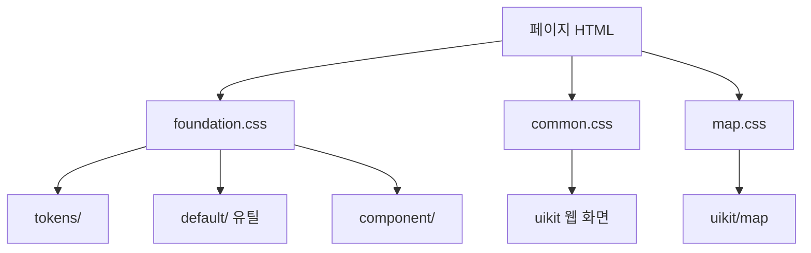

# EGIS CSS 가이드

경로 기준: `egis/assets/css/`  
HTML 붙이는 법 → [jsp.md](./jsp.md) · 파일 위치 → [structure.md](./structure.md)

---

## 1. 연결하는 법

1. `css`와 `font` 폴더를 **같은 상위 폴더 안에** 함께 넣습니다. (`foundation.css`가 `../font/`를 찾습니다.)

```
(상위폴더)/css/
(상위폴더)/font/
```

폴더 이름은 `assets`가 아니어도 됩니다. `css`만 넣고 `font`를 빼면 글꼴이 빠집니다.
2. `<head>`에서 **호출하는 CSS는 두 개뿐입니다.** `uikit`·화면 CSS를 `<link>`로 추가하지 않습니다.

웹 화면: (`href`는 실제 `css` 경로에 맞춥니다.)

```html
<link rel="stylesheet" href="${ctx}/assets/css/foundation.css" />
<link rel="stylesheet" href="${ctx}/assets/css/common.css" />
```

환경기초지도만 (`common.css` 대신):

```html
<link rel="stylesheet" href="${ctx}/assets/css/foundation.css" />
<link rel="stylesheet" href="${ctx}/assets/css/map.css" />
```

3. 새 CSS는 `<link>`를 늘리지 말고, `common.css` 또는 `map.css`에 `@import` 한 줄만 추가합니다.

```css
@import url('./uikit/login/login.css');
```

| 파일 | 역할 |
|------|------|
| `foundation.css` | 토큰 + 유틸 + 공통 컴포넌트 (모든 화면) |
| `common.css` | 웹 화면 UIKit |
| `map.css` | 환경기초지도 UIKit (`common.css`와 동시에 쓰지 않음) |

---

## 2. 폴더 구조

```
egis/assets/css/
├── foundation.css          ← 엔트리: 기반 + 공통 컴포넌트
├── common.css              ← 엔트리: 웹 화면 UIKit
├── map.css                 ← 엔트리: 지도 화면 UIKit
│
├── tokens/                 ← CSS 변수 정의 (:root)
│   ├── index.css
│   ├── color.css
│   ├── spacing.css
│   ├── typography.css
│   └── radius.css
│
├── default/                ← SolveK 유틸·리셋·레이아웃·아이콘
│   ├── common.css          (html 62.5%, reset, --layout-min-width)
│   ├── color.css           (.color-*, .bg-*)
│   ├── typography.css      (.heading*, .body*)
│   ├── spacing.css         (.p-*, .m-*, .gap-*, .w-*, .h-* …)
│   ├── layout.css          (.flex, .grid-*, .align-* …)
│   ├── border.css          (.border-*, .radius-*)
│   ├── responsive.css      (.inner-default 등)
│   ├── icon.css            (아이콘 배경 클래스)
│   └── component.css       (기반 보조)
│
├── component/              ← 재사용 UI (버튼, 인풋, 모달 …)
│   ├── button.css
│   ├── input.css
│   ├── search.css
│   ├── textarea.css
│   ├── checkbox.css
│   ├── radio.css
│   ├── chip.css
│   ├── datepicker.css
│   ├── select.css
│   ├── shadow.css
│   ├── modal.css
│   ├── breadcrumb.css
│   ├── pagination.css
│   └── meta-tag.css
│
└── uikit/                  ← 화면·기능별 레이아웃/컴포넌트
    ├── common/             (헤더, 푸터, 필터, 테이블, 토스트 …)
    ├── main/
    ├── search/
    ├── topical/
    ├── data-open/
    ├── user-support/
    ├── mypage/
    ├── login/
    ├── visual-tool/        (환경 시각화 도구)
    └── map/
```

---

## 3. 로드 관계



- `foundation.css` → 폰트, 토큰, `default/*`, `component/*`
- `common.css` → `uikit/common/*` + 웹 페이지별 uikit
- `map.css` → `uikit/map/*` (+ 필터 등 지도에서 쓰는 일부 공통)

`html { font-size: 62.5%; }` 이므로 **`1rem = 10px`** 기준으로 수치를 읽으면 됩니다.  
(예: `1.6rem` ≈ 16px, `var(--spacing-16)` = 1.6rem)

---

## 4. 엔트리 파일

### 4.1 `foundation.css`

모든 화면의 기반입니다.

| import | 내용 |
|--------|------|
| `font/pretendard/...` | Pretendard GOV |
| `tokens/index.css` | 색·간격·타이포·radius 변수 |
| `default/*` | 유틸 클래스, reset, 아이콘 |
| `component/*` | 버튼·폼·모달 등 공통 UI |

### 4.2 `common.css`

웹(지도 제외) 화면용입니다.

| 영역 | 파일 |
|------|------|
| 공통 | `uikit/common/header.css`, `footer.css`, `filter.css`, `applied-filter.css`, `table.css`, `toast.css` |
| 메인 | `uikit/main/main.css` (상세검색·AI 진행 팝업 포함) |
| 통합검색 | `uikit/search/search.css`, `ai-search.css`(AI 검색 결과·조건 수정 팝업) |
| 주제도 | `uikit/topical/topical.css`, `topical-detail.css` |
| 환경 시각화 도구 | `uikit/visual-tool/visual-tool.css` |
| 데이터 개방 | `uikit/data-open/open-api-detail.css`, `open-api-apply.css`, `land-cover.css` |
| 이용자 지원 | `uikit/user-support/notice.css`, `faq.css`, `inquiry.css`, `inquiry-write.css` |
| 로그인 | `uikit/login/login.css`, `app.css`(정부 통합인증 안내) |
| 마이페이지 | `uikit/mypage/mypage.css`, `openapi.css`, `inquiry.css`, `authkey.css`, `download.css` |

### 4.3 `map.css`

환경기초지도 전용입니다. `common.css`와 **동시에 쓰지 않습니다.**

| 파일 | 대략적인 역할 |
|------|----------------|
| `map-header.css` | 지도 헤더 |
| `map-view.css` | 지도 본문·스테이지 |
| `map-control.css` | 줌 등 컨트롤 |
| `map-navigation.css` | 좌측 내비 |
| `map-side-panel.css` | 사이드 패널 공통 |
| `result-panel.css` | 결과 패널 |
| `pagination.css` | 지도 결과 페이지네이션 |
| `region-select.css` | 행정구역 |
| `integrated-search.css` | 통합검색(지도) |
| `base-resource-map.css` | 기반자원지도 |
| `address-search.css` | 주소검색 |
| `spatial-search-panel.css` | 공간검색 패널 |
| `radius-search-popup.css` | 반경검색 팝업 |
| `spatial-search-toast.css` | 공간검색 토스트 |
| `spatial-search-results.css` | 공간검색 결과 |
| `map-sheet-search.css` | 도엽검색 |
| `layer-info-panel.css` | 레이어 정보 |
| `selected-layer-panel.css` | 선택 레이어 |
| `background-map-panel.css` | 배경지도 |
| `../common/filter.css` | 필터(지도에서도 사용) |

---

## 5. 토큰 (`tokens/`)

값은 `:root` CSS 변수로 정의됩니다. **하드코딩 hex보다 변수 사용**을 권장합니다.

| 파일 | 변수 예시 | 용도 |
|------|-----------|------|
| `color.css` | `--slate-900`, `--blue-500`, `--white` | 색상 팔레트 |
| `spacing.css` | `--spacing-8`, `--spacing-16`, `--spacing-24` | 여백·갭 |
| `typography.css` | `--font-size-body2`, `--font-weight-semibold` | 글꼴 크기·굵기 |
| `radius.css` | `--radius-md-8`, `--radius-lg-16`, `--radius-full` | 모서리 |

유틸 클래스는 이 변수를 감싸 둔 것입니다.

```css
/* tokens */
--spacing-16: 1.6rem;

/* default/spacing.css 유틸 */
.p-16 { padding: var(--spacing-16); }

/* uikit 컴포넌트 CSS에서도 동일 변수 사용 */
.main-hero { padding-top: var(--spacing-60); }
```

---

## 6. 유틸 클래스 (`default/`) — SolveK DS

마크업에서 바로 쓰는 **디자인 시스템 유틸**입니다.

### 6.1 색 (`default/color.css`)

| 패턴 | 예 | 의미 |
|------|----|------|
| `color-{palette}-{step}` | `color-slate-900` | 글자색 |
| `bg-{palette}-{step}` | `bg-blue-600` | 배경색 |
| `border-{palette}-{step}` | `border-slate-200` | (border 유틸과 함께) |

팔레트 예: `slate`, `gray`, `blue`, `green`, `navy` …

### 6.2 타이포 (`default/typography.css`)

이름 규칙: `{역할}-{굵기약어}-{크기}`

| 예 | 의미 |
|----|------|
| `heading3-sb-36` | heading3 / semibold / 36 |
| `body1-r-18` | body1 / regular / 18 |
| `body2-m-16` | body2 / medium / 16 |
| `body3-r-14` | body3 / regular / 14 |

굵기 약어: `b` bold · `sb` semibold · `m` medium · `r` regular

### 6.3 간격·크기 (`default/spacing.css`)

| 패턴 | 예 |
|------|----|
| padding | `p-16`, `px-20`, `py-8`, `pt-24` |
| margin | `m-0`, `mt-16`, `mb-8`, `mx-auto` |
| gap | `gap-8`, `gap-16`, `gap-24` |
| width/height | `w-full`, `h-40`, `w-fit` |

숫자는 대체로 `--spacing-{n}` 과 대응합니다 (`16` → `--spacing-16`).

### 6.4 레이아웃 (`default/layout.css`)

| 패턴 | 예 |
|------|----|
| flex | `flex`, `flex-col`, `flex-1`, `align-center`, `justify-between` |
| grid | `grid-column-default`, `grid-column-4` |
| 기타 | `relative`, `absolute`, `overflow-hidden` 등 |

### 6.5 보더·라운드 (`default/border.css`)

| 예 | 의미 |
|----|------|
| `border`, `border-slate-200` | 테두리 |
| `radius-md-8`, `radius-lg-16`, `radius-full` | 둥글기 |

### 6.6 레이아웃 폭 (`default/responsive.css`)

| 클래스 | 역할 |
|--------|------|
| `inner-default` | 콘텐츠 최대 폭·좌우 패딩 (헤더·본문·푸터 공통) |

최소 지원 폭: `--layout-min-width` (102.4rem). 모바일 전용 대응은 없음.

### 6.7 아이콘 (`default/icon.css`)

`<i class="...">` + `background-image` 방식입니다.  
아이콘 파일은 주로 `egis/assets/image/icon/` 아래입니다.

```html
<i class="header-search-24" aria-hidden="true"></i>
<i class="gov-masthead__flag" aria-hidden="true"></i>
```

새 아이콘: SVG 추가 → `icon.css`에 클래스 정의 → HTML에서 사용.

---

## 7. 공통 컴포넌트 (`component/`)

여러 화면에서 재사용하는 UI입니다. **클래스명은 마크업의 기존 이름을 따릅니다.**

| 파일 | 대표 용도 |
|------|-----------|
| `button.css` | 버튼 변형 (`transparent-button-40` 등) |
| `input.css` | 텍스트 입력 |
| `search.css` | 검색창 (`.search-54` 등) |
| `textarea.css` | 텍스트영역 |
| `checkbox.css` / `radio.css` | 체크·라디오 |
| `chip.css` | 필터 칩 |
| `datepicker.css` | Flatpickr 연동 스타일 |
| `select.css` | 셀렉트 |
| `modal.css` | 모달·다이얼로그 |
| `breadcrumb.css` | 브레드크럼 |
| `pagination.css` | 웹 페이지네이션 |
| `meta-tag.css` | 메타 태그 |
| `shadow.css` | 그림자 유틸 |

지도 전용 페이지네이션은 `uikit/map/pagination.css`를 씁니다.

### 7.1 레이어 팝업 (`modal.css`)

메인 상세검색, AI 조건 수정처럼 딤 배경이 깔리는 팝업은 모두 같은 구조입니다.

```html
<dialog class="modal-container" id="…">       <!-- 딤 배경(overlay-75) + 가운데 정렬 -->
  <form class="modal 화면-블록">                <!-- 흰 상자 -->
    <div class="modal__header">…</div>           <!-- 제목 + 닫기 -->
    <div class="modal__content">…</div>          <!-- 길면 이 영역만 스크롤 -->
    <div class="modal__footer">…</div>           <!-- 버튼 -->
  </form>
</dialog>
```

- 여는 쪽은 `dialog.showModal()`. 배경 클릭·Esc 닫기는 각 화면 JS가 처리합니다.
- `.modal`은 화면 폭 구간별 `max-width`가 있으므로, 고정 폭 팝업은 화면 블록 클래스에서 `width`와 `max-width`를 다시 줍니다.  
  예: `.main-detail.modal { width: 100rem; }`, `.ai-cond.modal { width: 70rem; }`
- 달력(flatpickr)은 `initPicker()`가 dialog 안에 붙입니다([js.md](./js.md) 공통 표).

### 7.2 자주 쓰는 폼·버튼 클래스

| 용도 | 클래스 |
|------|--------|
| 셀렉트 48 | `select-48` |
| 입력 48 | `input-field-default-48` (+ 오른쪽 아이콘이면 `input-with-trailing-icon`) |
| 검색 입력 48 | `search-48` |
| 체크박스 | `checkbox-basic checkbox-basic-md` |
| 라디오 | `radio-basic radio-basic-sm\|md\|lg`, 2칸 토글 `radio-toggle-group` > `radio-toggle-label` |
| 주 버튼 | `blue-button-48` |
| 보조 버튼 | `border-slate-button-48` |
| 텍스트 버튼 | `transparent-button-40` |

---

## 8. 화면 UIKit (`uikit/`)

화면/기능 단위 스타일입니다. **BEM에 가까운 네이밍**을 사용합니다.

```
블록__요소--수식
예: header-nav__link
    gov-masthead__inner
    main-feature-card--large
    map-view__canvas
```

| 접두/블록 | 영역 |
|-----------|------|
| `gov-masthead`, `header-*` | 웹 헤더·공식 누리집 안내 |
| `footer-*` | 푸터 |
| `main-*` | 통합 메인 (`main-hero-*`, `main-detail*` 상세검색, `main-ai-*` AI 진행 팝업) |
| `search-ai*`, `ai-cond*` | AI 검색 결과, 질문 조건 수정 팝업 |
| `vt-*` | 환경 시각화 도구 (`vt-tm-*` 트리맵, `vt-relation*` 관계도맵, `vt-expand*` 확장맵) |
| `tp-*` | 주제도(topical). 빠른 메뉴 `tp-quick*`, 카드 `tp-card*`는 통합검색·AI에서도 사용 |
| `oa-*` | Open API / 마이페이지 Open API |
| `notice-*`, `faq-*`, `inquiry-*` | 이용자 지원 |
| `map-*`, `result-panel`, `radius-search-*` | 지도 |

### 파일 ↔ 화면 매핑 (웹)

| uikit 파일 | 주요 화면 |
|------------|-----------|
| `common/header.css` | 전 웹 화면 (`web-header.html`) |
| `common/footer.css` | 전 웹 화면 (`footer.html`) |
| `main/main.css` | `pages/main/` |
| `search/search.css` | `pages/search/` |
| `search/ai-search.css` | `pages/search/ai.html` |
| `visual-tool/visual-tool.css` | `pages/visualTool/` |
| `topical/*.css` | `pages/topicalMap/` |
| `data-open/*.css` | `pages/data-open/` |
| `user-support/*.css` | `pages/userSupport/` |
| `login/login.css` | `pages/login/` |
| `mypage/*.css` | `pages/mypage/` |

---

## 9. 작성·수정 규칙 (중요)

### 9.1 어디에 쓸지

| 상황 | 위치 |
|------|------|
| 색·폰트·간단한 간격만 | HTML에 유틸 (`color-*`, `body*`, `gap-8` …) |
| 한 화면에만 쓰는 레이아웃·상태·모션 | 해당 `uikit/.../*.css` |
| 버튼·인풋처럼 여러 화면 공통 | `component/*.css` |
| 새 색/간격 토큰 | `tokens/` (합의 후) |
| 새 아이콘 | `assets/image/icon/` + `default/icon.css` |

### 9.2 하지 말 것

- 페이지 HTML에 `uikit` CSS를 **개별 `<link>`로 추가**하지 않기 → `common.css` / `map.css`에 `@import` 추가
- 컴포넌트 CSS에서 **타이포·컬러 유틸을 대체하는 하드코딩**을 남발하지 않기 (기존 마크업의 `heading*` / `color-*` 유지)
- 임시로 큰 단일 `component.css`에 전체 화면을 몰아넣지 않기 (이 레포 구조와 충돌)
- 클래스 **일괄 리네임(단축 접두어 변경)** 은 퍼블·연동 합의 없이 하지 않기

### 9.3 권장 패턴

```html
<!-- 좋음: 블록 클래스 + 유틸(폰트/컬러) -->
<a class="main-feature-card main-feature-card--large bg-blue-600">
  <h3 class="heading10-sb-20 color-white">환경기초지도</h3>
</a>
```

```css
/* uikit: 레이아웃·구조 */
.main-feature-card--large {
  display: flex;
  padding: var(--spacing-24);
  border-radius: var(--radius-lg-16);
}
```

### 9.4 네이티브 CSS 네스팅

이 레포의 퍼블 CSS는 **평탄한(flat) 셀렉터**를 기본으로 둡니다.  
개발 쪽에서 네스팅을 써도 되지만, **통합 시 클래스명·파일 분리 규칙이 우선**입니다. 네스팅 문법만 같다고 구조가 맞는 것은 아닙니다.

### 9.5 `[hidden]` 과 유틸

`.flex` 등 display 유틸이 `[hidden]`을 덮을 수 있습니다. 토글 UI는 컴포넌트 CSS에서 명시합니다.

```css
.일부패널[hidden] {
  display: none;
}
```

---

## 10. 새 화면 / 새 컴포넌트 추가 체크리스트

1. 마크업을 `pages/.../fragments/` 또는 `shared/fragments/`에 추가
2. 스타일이 화면 전용이면 `uikit/{영역}/{이름}.css` 생성
3. `common.css` 또는 `map.css`에 `@import` 한 줄 추가
4. 공통 폼/버튼이면 `component/` 확장 검토
5. 아이콘이면 `icon.css` + SVG 경로 확인
6. 페이지 `index.html`의 CSS 링크는 `foundation` + (`common`|`map`)만 유지

---

## 11. 자주 찾는 위치

| 하고 싶은 일 | 볼 파일 |
|--------------|---------|
| 공식 누리집 안내 바(마스트헤드) | `uikit/common/header.css`, `shared/fragments/web-header.html` |
| GNB·통합검색 레이어 | `uikit/common/header.css`, `assets/js/common/header.js` |
| 푸터·관련사이트 | `uikit/common/footer.css` |
| 메인 히어로·카드 | `uikit/main/main.css` |
| 메인 상세검색 팝업 | `uikit/main/main.css` — `/* 상세검색 모달 */` 블록 |
| AI 검색 진행 팝업 | `uikit/main/main.css` — `/* AI 검색 프로그레스 */` 블록 |
| AI 검색 결과·조건 수정 | `uikit/search/ai-search.css` |
| 환경 시각화 도구 | `uikit/visual-tool/visual-tool.css` |
| 레이어 팝업 공통 | `component/modal.css` |
| 토스트 위치 | `uikit/common/toast.css`, `assets/js/common/toast.js` |
| 지도 결과 패널 | `uikit/map/result-panel.css` |
| 색 값 확인 | `tokens/color.css` + `default/color.css` |
| 폰트 유틸 확인 | `default/typography.css` |

---

## 12. 통합 시 참고

클래스명은 fragment HTML이 기준입니다. 개발 임시 클래스(`#topMenu` 등)는 퍼블 클래스명으로 맞춥니다.
